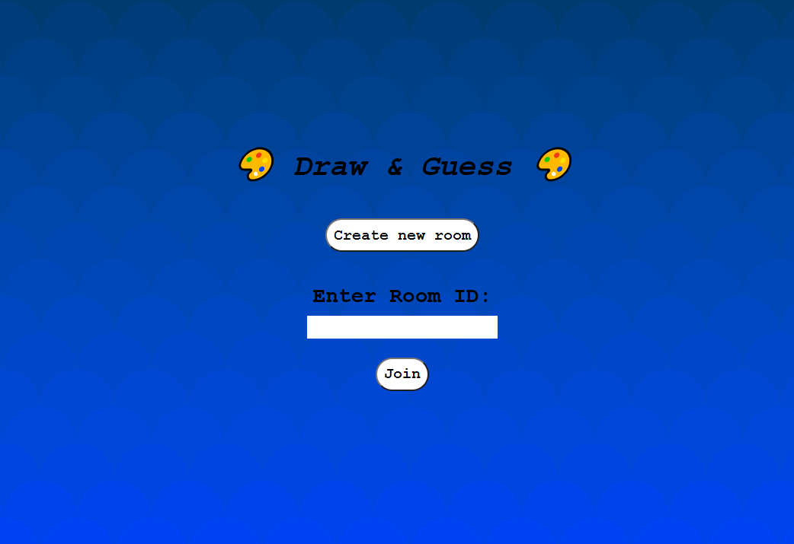
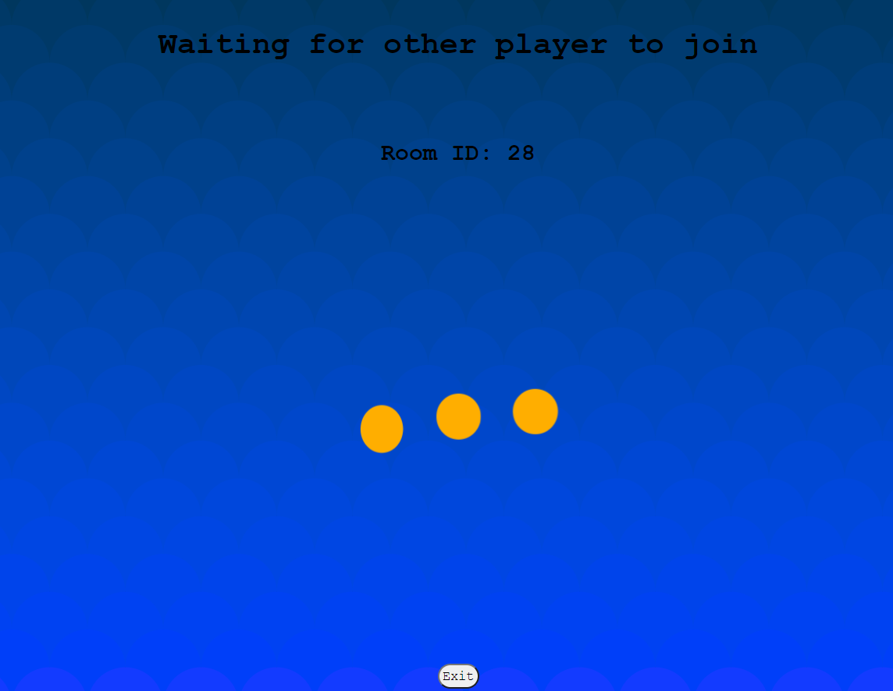
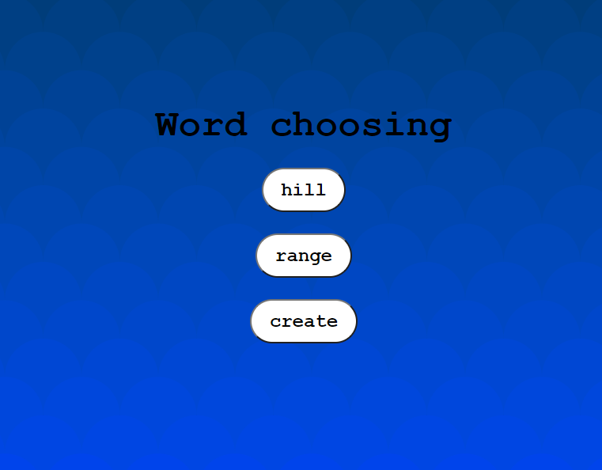
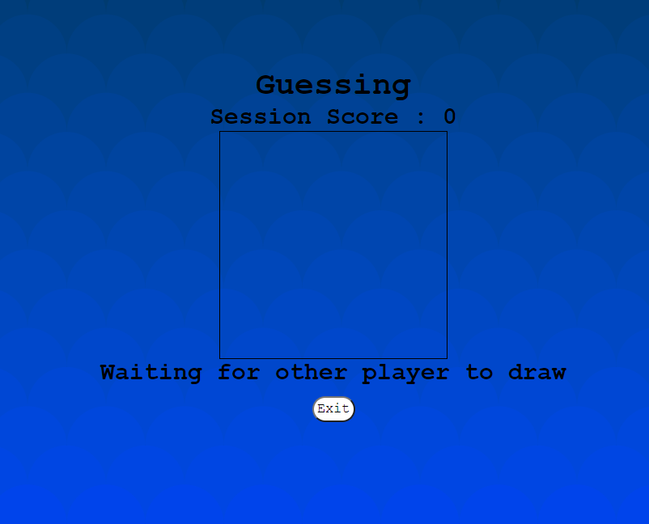
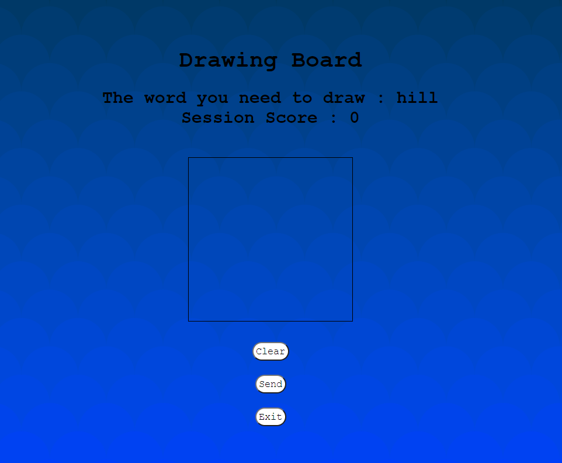
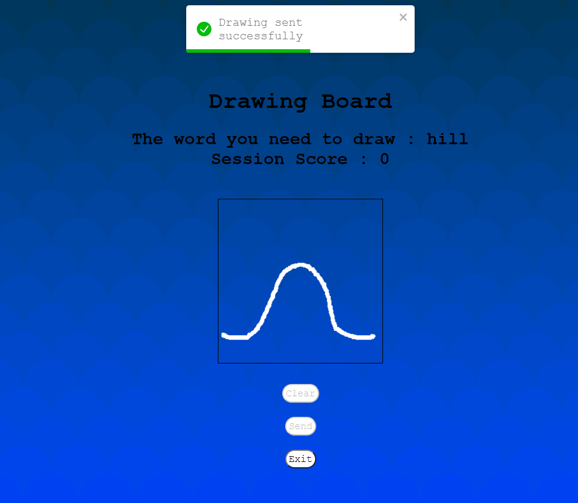

# 🎨 Draw and Guess 🎨

---
Guess and Draw is game which two players take turns drawing a picture of a given word,

after which their partner must guess the word from the drawing.

The person drawing will always have a choice of three words worth one, three and five stars.


## 🖌️ Game play 🖌️

---
### First step - Connect to client to room

Two clients enter the application and receive the welcome view(Image 1),

One client create a room he will receive room ID and wait other player at wait room (Image 2), 

the other client join his room by room ID.

#### Image 1


#### Image 2


### Second step - Choose the word and draw

Once two clients joined the room,

client_1  will choose a word to draw at word choosing view (Image 3).

meanwhile, client_2 wait for draw at the guessing view (Image 4).

now, client_1 needs to draw the word and send it at the drawing board view (Images 5 and 6).

#### Image 3


#### Image 4


#### Image 5


#### Image 6


### Third step - View the draw and submit answer

Once the draw received, the option to view the draw will be enabled (Image 7).

Now client_2 submit his answer (Image 8), if the answer is correct the session will gain score,

and the clients switch roles.

#### Image 7


#### Image 8


### Scoring roles
* A word three or four letters long is worth one point.
* A word five letters long is worth three points.
* A word six letters long is worth five points.


### Server data
Example of the structure hold the data at the server.

```react 
serverData[roomID] = {drawing:{data:[],
                      ready:false},
                      PlayersInRoom : 1,
                      chosenWord:"",
                      roundOver : false,
                      SessionScore: 0,}

```

```react
data[] = { x: X,
           y: Y,
           start: false,
           time: date.getTime()}
```


