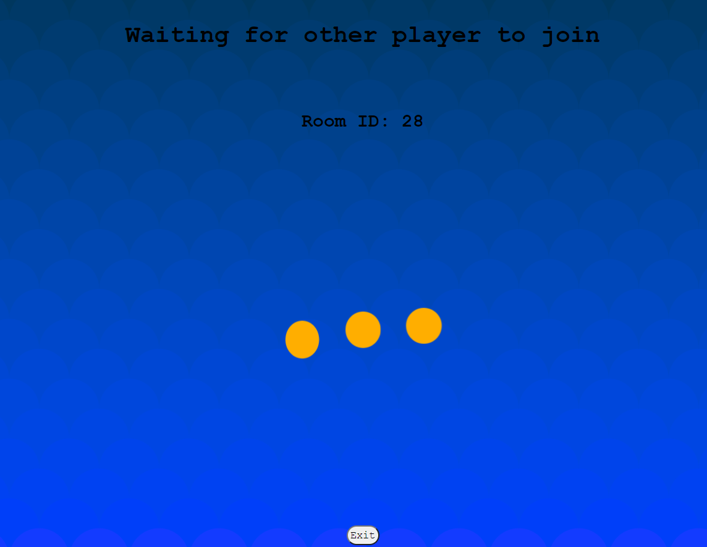
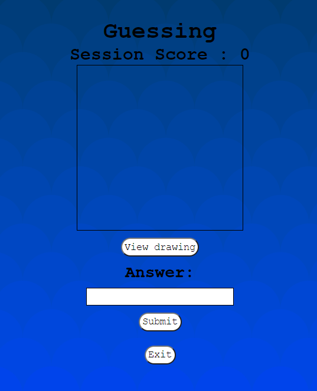
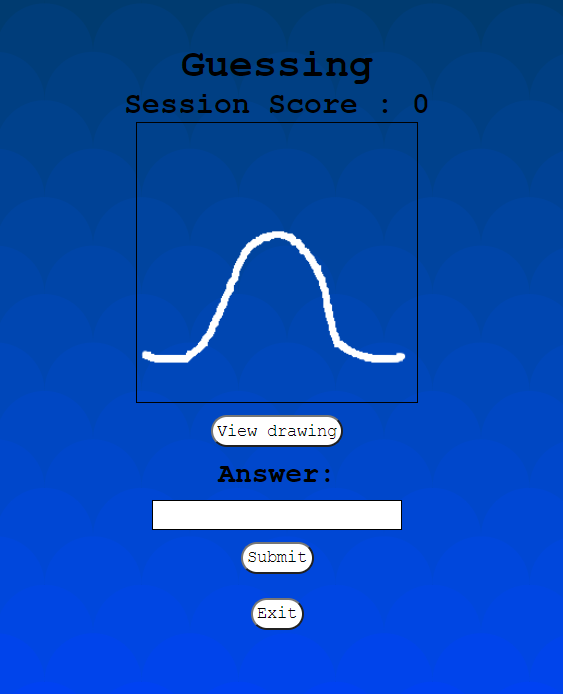

🎨 Draw and Guess 🎨
===

---
Guess and Draw is a game which two players take turns drawing a picture of a given word, 
after which their partner must guess the word from the drawing.


The person who is drawing, will always have a choice of three words worth one, three and five points.


## 🖌️ Gameplay 🖌️

---
### First step - Connect to client to room

Two clients enter the application and receive the welcome view (Image 1), 
Once `drawing_player` creates a room, he will receive the room ID and wait for `guessing_player` at the waiting room (Image 2),
`guessing_player` will join the same room using the room ID.

#### Image 1


#### Image 2


### Second step - Choose the word and draw

Once both clients join the room, `drawing_player` will choose a word to draw at the word choosing view (Image 3),
meanwhile, `guessing_player` waits for a drawing at the guessing view (Image 4),
at this point `drawing_player` needs to draw the word and send it using the drawing board view (Images 5 & 6).

#### Image 3


#### Image 4


#### Image 5


#### Image 6


### Third step - View the draw and submit answer

Once the drawing is received by the server, the option to view the drawing will be enabled (Images 7 & 8), 
the `guessing_player` will submit their answer and the roles will be switched.
 
If the answer is correct the players will gain score according to the difficulty of the chosen word.

#### Image 7


#### Image 8



### Scoring rules
* A word three or four letters long is worth one point.
* A word five letters long is worth three points.
* A word six letters long is worth five points.


### Server data
Example of the structure hold the data at the server.

```js 
serverData[roomID] = {drawing:{data:[],
                      ready:false},
                      PlayersInRoom : 1,
                      chosenWord:"",
                      roundOver : false,
                      SessionScore: 0,}

```

## Dependencies:

---
This project was written using JavaScript, Node.js and React.js

## Running Instructions

---
After clone, you need to run the follow commands in each directory, Client and Server.

### Command to install required libraries
`npm install`
### Command to run the Client/Server
`npm start`

## Credits:

---
`random-words`: [https://github.com/apostrophecms/random-words](https://github.com/apostrophecms/random-words)

